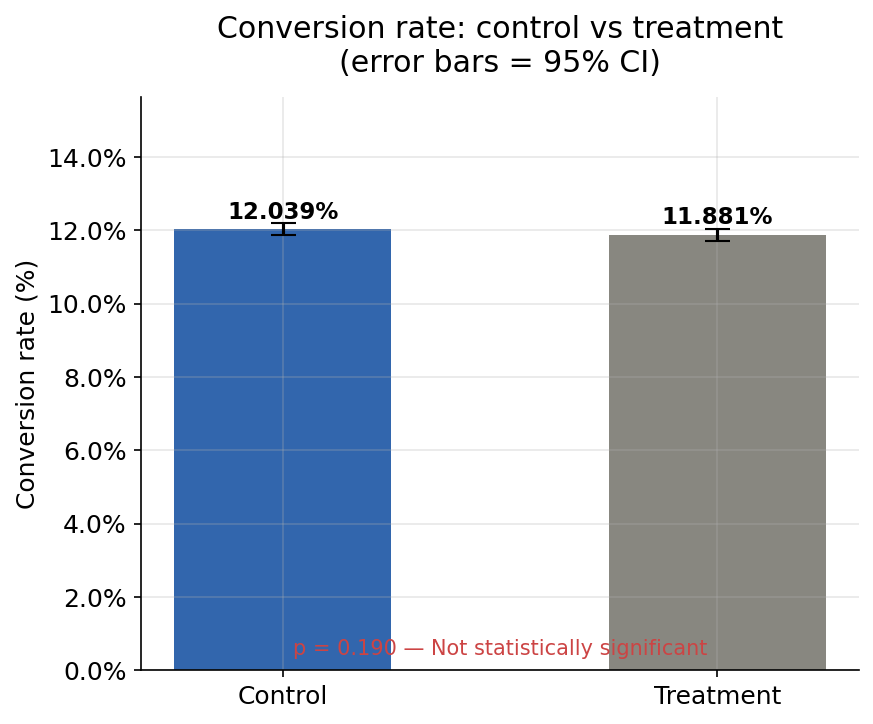
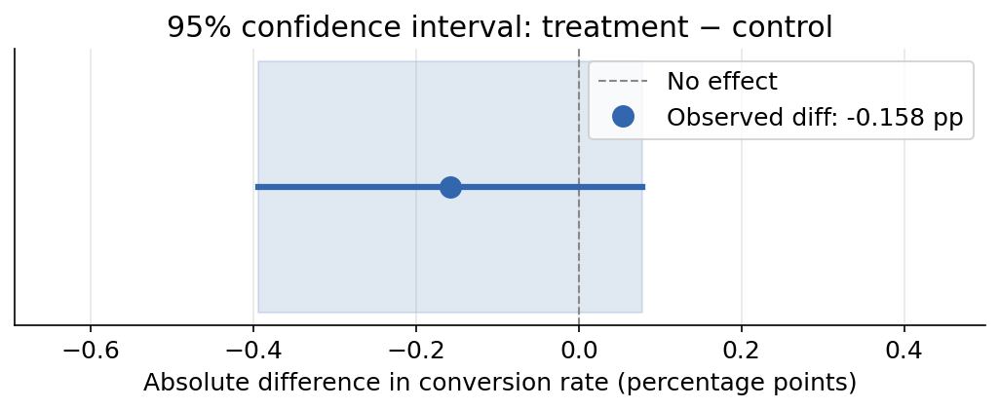
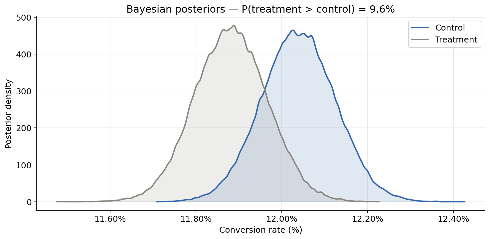
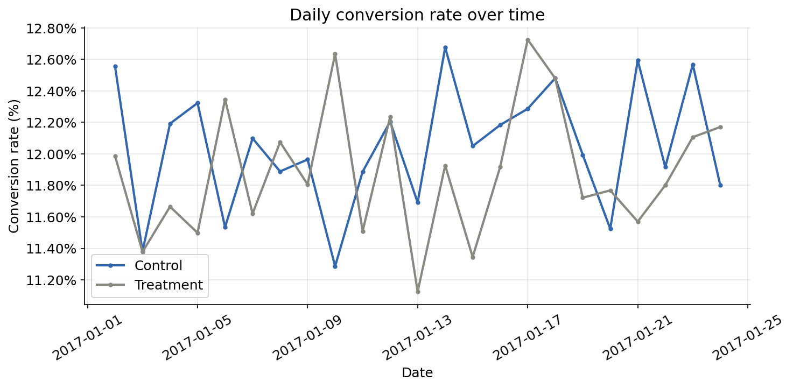

# A/B Testing — End-to-End Analysis

A complete end-to-end A/B test analysis project: from experiment design through statistical testing to a business recommendation. Built in Python, backed by frequentist and Bayesian statistics.

## The Experiment

A landing page A/B test — does a new page design increase user conversion?

**Result: No. The new page does not outperform the old one.**  
Tested on 290k+ users. P-value = 0.19. Recommendation: retain the current page.

---

## Project Structure

```
ab_testing_project/
├── data/
│   ├── raw/              # Original dataset (ab_data.csv)
│   └── cleaned/          # Post-cleaning dataset
├── notebooks/
│   ├── 01_power_analysis.py     # Sample size calculation (pre-experiment design)
│   ├── 02_eda_and_cleaning.py   # Exploratory analysis + data quality fixes
│   ├── 03_statistical_analysis.py  # Z-test, chi-square, Bayesian test
│   └── 04_time_analysis.py      # Novelty effects, daily/weekly trends
├── src/
│   ├── data_loader.py    # Load + clean raw data
│   ├── power_analysis.py # Sample size & power calculations
│   ├── stats.py          # Statistical test implementations
│   └── visualize.py      # All plotting functions
├── outputs/              # Generated charts (PNGs)
├── report/
│   └── findings.md       # Written findings and recommendation
└── requirements.txt
```

---

## Key Methods

| Stage | Approach |
|---|---|
| Experiment design | Two-proportion z-test power analysis |
| Data cleaning | Mismatch removal, deduplication |
| Frequentist test | Two-proportion z-test + chi-square cross-check |
| Bayesian test | Beta-Binomial conjugate model |
| Temporal analysis | Daily trend + day-of-week breakdown |

---

## Setup

```bash
git clone https://github.com/yourname/ab-testing-analysis
cd ab-testing-analysis
pip install -r requirements.txt
```

Run any notebook:
```bash
cd notebooks
jupyter notebook
# or run as a script: python 01_power_analysis.py
```

---

## Results Summary

| Metric | Value |
|---|---|
| Control conversion | 12.04% |
| Treatment conversion | 11.88% |
| Absolute difference | −0.16 pp |
| Z-statistic | −1.31 |
| P-value | 0.19 |
| 95% CI | [−0.39 pp, +0.08 pp] |
| P(treatment > control) | ~9% (Bayesian) |

---

## Skills Demonstrated

- Experiment design and power analysis
- Data quality assessment and cleaning
- Frequentist hypothesis testing
- Bayesian inference (Beta-Binomial model)
- Time series analysis for novelty effects
- Data visualisation with matplotlib/seaborn
- Technical writing and business communication
- ## Charts

### Conversion rate by group


### 95% Confidence interval


### Bayesian posteriors


### Daily conversion trend

## Result

> **The new landing page does not outperform the old one.**  
> p = 0.19 · 95% CI [−0.39 pp, +0.08 pp] · tested on 290,000+ users
